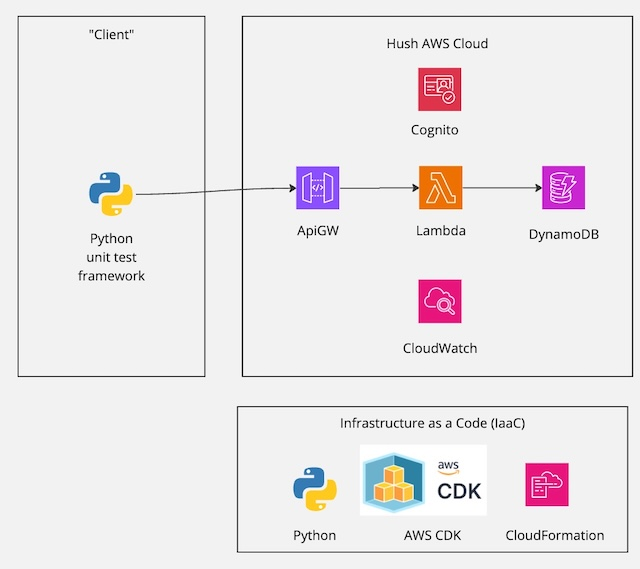

# AWS Multi-region

## Overview

Hello world demo of multi-region AWS deployment with Python CDK.

Main purpose of this project is to be a personal competence development project. Also this can hopefully serve as future reference to many details related to AWS deployment.

Project does not "do" much really, but there is a REST API that can be used for storing and retrieving table tennis match scores. This is a functional API that can be used for score bookkeeping.

## Architecture

Current AWS architecture is displayed in below diagram.

Notice that there is and will not be actual client for the time being. Instead the python test cases act as client and also serve as reference in case real client would be implemented at some point.

## Design principles

Some design principles in random order:

* **Mono-repo**: All Infrastructure code, backend and test code is the same repository.
* **Backend**: Everything done with serverless Lambda functions implemented in Python.
* **Database**: DynamoDB used with "single table design" principle
* **Infrastructure**: Everything done with Python CDK
* **Simplicity**: Extra frameworks and dependencies are not added until absolutely needed.
* **Test driven development**: All backend code is covered by test cases.
* **Fast experiments**: When in doubt, do implementation one way and then start all over if first approach did not work.

## Current state of the project

What is in place:

* ApiGW, Lambdas, DynamoDB, Cognito, CloudWatch in CDK stacks
* Cognito authorization for restricted Lambdas
* Rudimentary backend Lambdas implementation
* API test suite to test API endpoints

What is missing:

* Swagger documentation for the REST API
* Different environments for DEV, STAGE, PROD
* Multi-region set-up
* GitHub actions for automated deployment
* Instructions for local development of backend
* Recommended linter file configurations

Things that need refactoring

* Backend Lambdas need better structure like: Parameter validation, business logic, response handling.
* CDK Lambda stack is starting to get long in current format, needs re-thinking soon
* Some test cases need fine tuning so they are more elegant.

## Requirements for environment

Pip needs to be installed
Python 3 needs to be installed
Npm needs to be installed

## Prepare CDK related things

    cd infrastructure
    pip install -r requirements.txt
    npm install -g aws-cdk

## Prepare AWS Account

Create role "cdk-role" etc. to be used. Add "Maximum session duration" to 12h for convenience.

Add role ARN HUSH_CDK_ROLE environment variable.here we assume `.env_hush` file.

Assume role to get temporary credentials.

   cd infrastructure
   source .env_hush
   source ./assume-role.sh

Configure AWS CLI with credentials and region

    aws configure

Test credentials by running:

    aws sts get-caller-identity

Above should return the role you were defining.

## Use Python virtual environment

    cd infrastructure
    python3 -m venv .venv
    source .venv/bin/activate

## Deploy stack

    cdk bootstrap
    cdk synth --all
    cdk deploy --all

## Iterating

    cdk diff

## Get endpoints

    aws apigateway get-rest-apis --query "items[*].[name,id]" --output table
    aws apigateway get-stages --rest-api-id <api-id> --query "item[*].[stageName,invokeUrl]" --output table
    aws apigateway get-integration --rest-api-id {api_id} --resource-id {resource_id} --http-method GET

## Troubleshooting

    cdk bootstrap -v

## Running tests

### Preparation

You need to add API GW base URL and AWS region to environment variables. For example add to `.env-tests` file:

    export HUSH_APIGW_URL=https://<your-api-gw-url-here>/prod
    export HUSH_AWS_REGION=<your-region-here>

For test running with python unit test framework, prepare this:

    cd tests/rest-api
    python3 -m venv venv
    source venv/bin/activate
    python3 -m pip install -r requirements.txt

### Running API tests

Run all tests with:

    cd tests/rest-api
    python -m unittest discover -p "*_test.py"

To run a specific test suite run

    cd tests/rest-api
    python3 -m unittest api_test.py

Run only one test case with

    cd tests/rest-api
    python3 -m unittest cognito_test.py -k test_user_sign_up

## Limitations

Has been tested in Frankfurt (eu-central-1)
